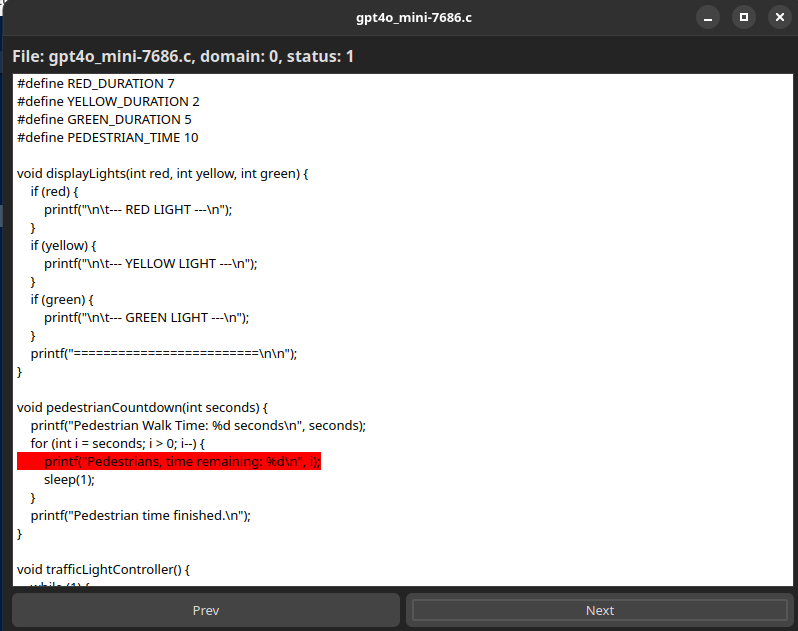

# End-to-end example

Let's demonstrate the full method using the AI code detection task. For this purpose, we'll use a small subset of [AI_DETECTION](../README.md#ai-code-detection) dataset. GeForce NVIDIA 4060 8gb is utilized to train models.

## Download and unzip the dataset

[Download the AI_DETECTION_SMALL dataset](https://disk.yandex.ru/d/hTI1V3Rbtm0AAg)

```bash
unzip AI_DETECTION_SMALL.zip
```

Its structure is shown below:

``` bash
│  ...
├── AI_DETECTION_SMALL
│  ├──  test
│  │  └── ...
│  └──  train
│  │  └── ...
│  ├──  valid
│  │  └── ...
│  └── labels.csv
│  ...
```

## Extract AST-tokens from the training, test and validation subsets

Edit the ```extractor_preferences.json```:

```json
{
    "threads": 12,
    "minlen": 1,
    "maxsize": 2000,
    "lang": "c",
    "dir": "AI_DETECTION_SMALL/train",
    "traversal": "root_terminal",
    "token": "masked_identifiers",
    "split": "ids_hash",
    "outdir": "example",
    "mapping": "AI_DETECTION_SMALL/labels.csv"
}
```

Here, we run the extractor in parallel using 12 threads. The provided ```c``` dataset is of sufficient quality, so there's no need to remove any AST tokens (```minlen=1```). The maximum length of a submission is 2000 tokens. Results are stored within the newly created ```example``` folder.

```bash
./build/bin/extract extractor_preferences.json
```

Likewise, run extractor 2 times more, for ```valid``` and ```test``` subdirectories.

At the moment:

``` bash
│  ...
├── example
│  └──  test
│  │  ├── labels.txt # extracted labels (<domain>_<class>)
│  │  ├── mapping.json # vocabulary hash-terminal
│  │  ├── submissions.txt # list of extracted submissions
│  │  └── tokens.txt # sequences of AST-tokens for each submission
│  └──  train
│  │  ├── labels.txt
│  │  ├── mapping.json
│  │  ├── submissions.txt
│  │  └── tokens.txt
│  └──  valid
│     ├── labels.txt
│     ├── mapping.json
│     ├── submissions.txt
│     └── tokens.txt
│  ...
```

## Combine vocabularies

Change the ```model_preferences.json```:

``` json
{
    "train_x": "example/train/tokens.txt",
    "test_x": "example/test/tokens.txt",
    "valid_x": "example/valid/tokens.txt",
    "train_y": "example/train/labels.txt",
    "test_y": "example/test/labels.txt",
    "valid_y": "example/valid/labels.txt",
    "train_vocab": "example/train/mapping.json",
    "test_vocab": "example/test/mapping.json",
    "valid_vocab": "example/valid/mapping.json",
    "train_sub": "example/train/submissions.txt",
    "test_sub": "example/test/submissions.txt",
    "valid_sub": "example/valid/submissions.txt",
    "token_to_idx": "example/token_to_idx.txt",
    "label_to_idx": "example/label_to_idx.txt",
    "domain_to_idx": "example/domain_to_idx.txt",
    "hash_to_terminal": "example/hash_to_terminal.json",
    "domain_classes": 
    [
        "0",
        "1"
    ],
    "embeddings": "",
    "model_path": "example/model",
    "kernel_size": 15,
    "embedding_dim": 384,
    "num_filters": 128,
    "dropout": 0.5,
    "weight_decay": 0.0001,
    "learning_rate": 0.0001,
    "batch_size": 64,
    "num_epochs": 1,
    "cuda": true
}
```

This command will create different mappings: ```token_to_idx```, ```label_to_idx```, ```domain_to_idx``` and ```hash_to_terminal``` 

``` bash
./build/bin/vocab model_preferences.json
```

The obtained directory tree as it is:

``` bash
│  ...
├──  data
│  ├── test
│  │  └── ...
│  ├── train
│  │  └── ...
│  ├── valid
│  │  └── ...
│  ├── domain_to_idx.txt
│  ├── hash_to_terminal.json
│  ├── label_to_idx.txt
│  └── token_to_idx.txt
│  ...
```

## Train the ASTCODA model

Run:

``` bash
python3 astcoda/train.py model_preferences.json
```

In the ```model_preferences.json``` above shown above, the convolution window size is set to **15**, he embedding dimensionality is **384**, and the number of filters is **128**. The domain class **0** corresponds to human-written problems, while **1** indicates AI-generated ones.

In this example, pretrained embeddings are not used. If you want to train and use your own embeddings, refer to [this tutorial](../docs/train_embeddings.md).

Here, we train the model for only **1** epoch.

Expected output:

``` bash
Reading datasets...
53899it [00:02, 23240.79it/s]
53899it [00:00, 4400537.08it/s]
569229it [00:00, 2094234.50it/s]
2it [00:00, 84733.41it/s]
15404it [00:00, 25581.00it/s]
15404it [00:00, 4097219.79it/s]
569229it [00:00, 2103498.76it/s]
2it [00:00, 104857.60it/s]
7694it [00:00, 27158.82it/s]
7694it [00:00, 4122505.75it/s]
569229it [00:00, 2084079.57it/s]
2it [00:00, 99864.38it/s]
Embeddings... no
Device... cuda:0
Model:
ASTCODA(
  (dropout): Dropout(p=0.5, inplace=False)
  (pad): ConstantPad1d(padding=(14, 14), value=0)
  (embedding): Embedding(569231, 384, padding_idx=0, max_norm=1.0)
  (conv): Conv1d(1, 128, kernel_size=(5760,), stride=(384,))
  (attention_domains): Embedding(1, 128, padding_idx=0, max_norm=1.0)
  (fcs): ModuleList(
    (0): Linear(in_features=128, out_features=2, bias=True)
  )
  (bn_conv): BatchNorm1d(128, eps=1e-05, momentum=0.1, affine=True, track_running_stats=True)
)
Training...
Epoch	TrLoss	TrAcc	TrF1	TrPrec	TrRec	EvLoss	EvAcc	EvF1	EvPrec	EvRec	BestEvAcc
Training: 100%|███████████████████████████████████████████████████████| 843/843 [10:35<00:00,  1.33it/s]
Validating: 100%|█████████████████████████████████████████████████████| 241/241 [02:16<00:00,  1.76it/s]
0	0.01076	99.70	1.00	1.00	1.00	0.00086	99.99	1.00	1.00	1.00	99.99
Testing...
Test Acc	Test F1	Test Precision	Test Recall
Testing: 100%|█████████████████████████████████████████████████████| 7694/7694 [00:09<00:00, 844.92it/s]
99.9740	0.9997	0.9998	0.9997
Saving weights...
```

Directory tree:

``` bash
│  ...
├──  data
│  ├── model
│  │  └── model_k15_nf128_e384
│  │  │  └── logs
│  │  │  │  └── metrics.json # loss, accuracy and so on
│  │  │  ├── weights # weights for further c++-based evaluation
│  │  │  │  ├── attention_domains.bin
│  │  │  │  ├── bn_alpha.bin
│  │  │  │  ├── bn_beta.bin
│  │  │  │  ├── bn_mean.bin
│  │  │  │  ├── bn_var.bin
│  │  │  │  ├── conv_bias.bin
│  │  │  │  ├── conv_matrix.bin
│  │  │  │  ├── embeddings.bin
│  │  │  │  ├── fc_biases.bin
│  │  │  │  └── fc_matrices.bin
│  │  │  ├── config.json # copy of model_preferences.json
│  │  │  └── model.pt # the model obtained
│  ├── test
│  │  └── ...
│  ├── train
│  │  └── ...
│  ├── valid
│  │  └── ...
│  ├── domain_to_idx.txt
│  ├── hash_to_terminal.json
│  ├── label_to_idx.txt
│  └── token_to_idx.txt
│  ...
```

## Generate the list of line numbers corresponding to the particular domain class

```test_preferences.json```:

``` json
{
    "test_x": "AI_DETECTION_SMALL/test",
    "test_y": "AI_DETECTION_SMALL/labels.csv",
    "label_to_idx": "example/label_to_idx.txt",
    "domain_to_idx": "example/domain_to_idx.txt",
    "embedding_dim": 384,
    "kernel_size": 15,
    "num_filters": 128,
    "weights_path": "example/model/model_k15_nf128_e384/weights",
    "chosen_lines": "example/chosen_lines.txt",
    "lang": "c",
    "minlen": 1,
    "threshold": 0.5
}
```

Run to obtain the list of maybe AI-generated lines - ```chosen_lines.txt```:

```bash
/build/bin/evaluate test_preferences.json
```

Now:

``` bash
│  ...
├──  data
│  ├── model
│  │  └── ...
│  ├── test
│  │  └── ...
│  ├── train
│  │  └── ...
│  ├── valid
│  │  └── ...
│  ├── chosen_lines.txt
│  ├── domain_to_idx.txt
│  ├── hash_to_terminal.json
│  ├── label_to_idx.txt
│  └── token_to_idx.txt
│  ...
```

## Visualize the results

```bash
./build/bin/visualize test_preferences.json
```

In the following picture the ASTCODA model considered the given code snippet to be AI generated because of the line highlighted in red:


